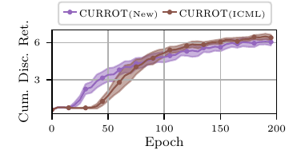

This folder contains the code accompanying the ICML paper "Curriculum Reinforcement Learning via Constrained Optimal Transport". 
For re-creating the experiments from the main paper, please switch to the [ICML Branch](https://github.com/psclklnk/currot/tree/icml). 
The main branch (which you are looking at right now) features an **improved version** of the algorithm which improves 
the run-time of the optimization. Conceptually, the changes are as follows:

1. We estimate the performance of the learner via **Nadaraya-Watson kernel- instead gaussian process regression**.
We switched to this method as we realized that the length-scale of the ARD GP tends to shrink to very small values if 
there are regions in which the value differs a lot. Since the lengthscales of the GP are applied globally, the small 
lengthscales required to explain regions with a large change in value, can hinder particle movement in regions of the 
context space in which the agent is already proficient. The Nadaraya-Watson estimator does not face this problem while 
not requiring critical hyperparameters to be chosen by the user.
2. We **replaced the GurobiPy and GeomLoss dependencies by using the linear_sum_assignment method from SciPy** to solve the
assignment problems required for the curriculum generation.
3. **Instead of optimizing the objective in a gradient-based manner using IPOPT, we solve a more restricted version using
sampling-based methods.** The more restricted version replaces the constraint on the average particle distance by a constraint
that enforces the average distance on each particle. This restriction, however, allows to optimize the position of each
particle fully individually. We do this local optimization by sampling candidates within the allowed distance and 
selecting the candidate which is closes to the target position of the particle while fulfilling the performance threshold.
This decomposition of the objective leads to faster optimization, while the sampling-based optimization avoids pitfalls 
of local optima in the estimated value function.

As shown, in the plots below, the method in the main branch performs better or similar to the ICML version. We did not re-compute the experiments for the TeachMyAgent benchmark, as it is quite compute intensive.

Point-Mass Environment:\
 \

Maze Environment\


For the sparse goal reaching and point mass environment, we used Python 3.8 to run the experiments. The required dependencies are listed in the **requirements.txt**
file and can be installed via
```shell script
cd nadaraya-watson
pip install .
pip install -r requirements.txt
```
The experiments can be run via the **run.py** scripts. For convenience, we have created the 
**baseline_experiments.sh** and **interpolation_based_experiments.sh** scripts for running the baselines and interpolation-based algorithms.  To execute all experiments for particular seed (in the example
below seed 1), you can run
```shell script
./baseline_experiments.sh 1
./interpolation_based_experiments.sh 1
```
After running the desired amount of seeds, you can visualize the results via
```shell script
cd misc
./visualize_results.sh
```
